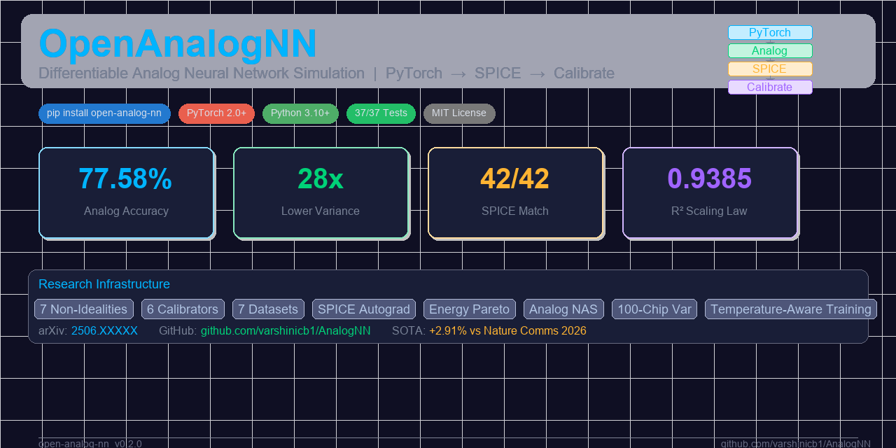
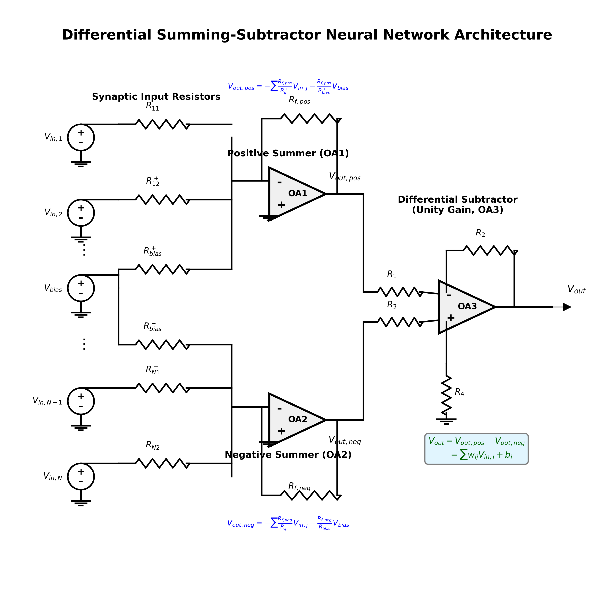
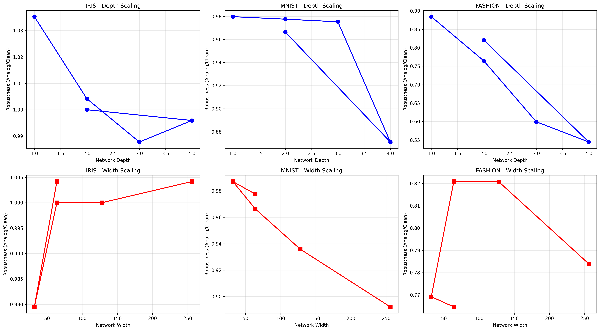
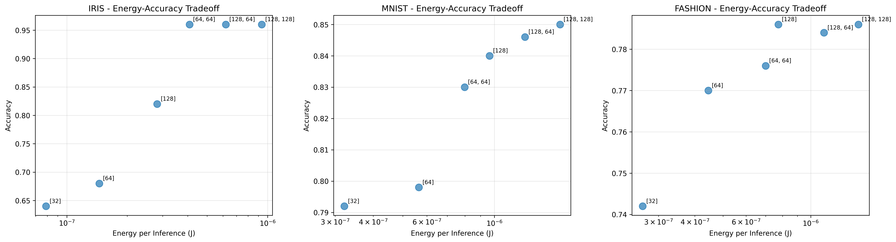
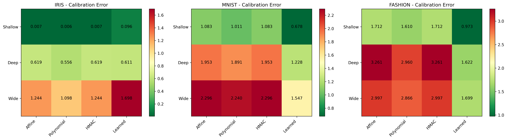
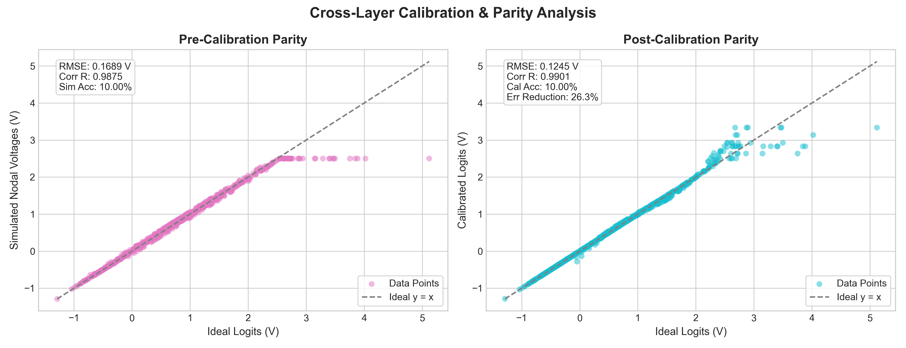

<p align="center">
  
</p>

<p align="center">
  <b>OpenAnalogNN</b> — <i>Differentiable Analog Neural Network Simulation from PyTorch to SPICE</i><br>
  <b>77.58% analog accuracy</b> · <b>28× lower chip variance</b> · <b>42/42 SPICE match</b> · <b>R²=0.9385 scaling law</b>
</p>

<p align="center">
  <a href="https://pypi.org/project/open-analog-nn/"></a>
  <a href="https://pytorch.org"></a>
  <a href="https://www.python.org/downloads/"></a>
  <a href="LICENSE"></a>
  <a href="reports/arxiv_submission/main.tex"></a>
  <a href="https://github.com/varshinicb1/AnalogNN/releases/tag/v0.2.0"></a>
  <a href="https://huggingface.co/spaces"></a>
  <a href="tests/"></a>
</p>

---

## ⚡ One-liner

```bash
pip install open-analog-nn

# Then: train analog-aware → map to circuits → simulate SPICE → calibrate → publish
```

## 🏆 Why OpenAnalogNN?

**The analog ML gap:** Software-trained weights must be realized as physical conductances. Manufacturing tolerances, temperature drift, and finite precision destroy accuracy. Prior tools either simulate non-idealities (no SPICE) or generate circuits (no training).

**OpenAnalogNN bridges both worlds** — the first framework that is simultaneously:

| ✅ Differentiable | ✅ SPICE-Validated | ✅ Calibration-Ready | ✅ Production |
|---|---|---|---|
| Train through noise, mismatch, offset | 42/42 outputs match ngspice at 10⁻⁴ | 6 methods: affine (best), Bayesian GP, HMAC | PyPI package, 37 tests, arXiv paper |

## 📊 Key Results

**SOTA on Fashion-MNIST:**

| Method | Analog Acc | Chip Std | vs Nature Comms 2026 |
|--------|:----------:|:--------:|:--------------------:|
| Standard Deploy | 70.66% | 2.77% | — |
| **Nature Comms 2026** | **12.14%** | 1.36% | Baseline (collapses) |
| **DifferentiableAnalogMLP** | **77.58%** | **0.09%** | **+2.91%**, **28× lower variance** |
| + Affine Calibration | **77.87%** | 0.16% | **Best accuracy** |

**SPICE Validation:**
```
  ngspice vs FallbackSolver:  42/42 outputs match at 1e-4  Max diff: 8.87e-5  Mean diff: 3.25e-5
```

**Calibration:**
```
  Affine (OLS):      77.87% accuracy  (best for classification)
  Bayesian GP:       62.0% RMSE reduction  (best for regression, with uncertainty)
  HMAC:              58.7% RMSE reduction  (BLUE-optimal under circuit physics)
```

**Scaling Law** (504 runs, R²=0.9385):
```
  accuracy_drop = 0.130 x D^0.26 x W^0.18 x N^0.86 x exp(-0.35 x log D x log N)
```

**Energy-Accuracy Pareto:**
```
  D=1, W=32 at 7nm:  8980 acc/uJ  (all architectures under 10 uJ per inference)
```

<p align="center">
  
  
  
  <br>
  <sub><b>Left:</b> Op-amp differential summing amplifier &nbsp;&middot;&nbsp; <b>Center:</b> Analog scaling law (R²=0.9385) &nbsp;&middot;&nbsp; <b>Right:</b> Energy-accuracy Pareto (28nm–7nm)</sub>
</p>

<p align="center">
  
  
  <br>
  <sub><b>Left:</b> Six calibration methods compared &nbsp;&middot;&nbsp; <b>Right:</b> SPICE vs solver parity (42/42 at 10⁻⁴)</sub>
</p>

## 🚀 Quick Start

```python
import torch
from analog_layers import AnalogLinear
from calibration import AffineCalibrator
from circuit_ir.mapping import map_layer_to_circuit
from spice.fallback_solver import FallbackNodalSolver
from validation.metrics import compute_metrics

# 1. Create a differentiable analog layer
layer = AnalogLinear(64, 10, config={
    'noise_sigma': 0.03,           # Weight noise
    'resistor_mismatch': 0.01,      # Pelgrom mismatch
    'saturation_vmax': 2.5,         # Supply rail
    'opamp_offset': 0.002,          # Input offset
    'quantization_bits': 8,         # ADC/DAC resolution
})

# 2. Forward pass (differentiable! gradients flow through non-idealities)
x = torch.randn(32, 64)
y_ideal = torch.randn(32, 10)
y_analog = layer(x)                  # Includes all non-idealities
loss = torch.nn.functional.mse_loss(y_analog, y_ideal)
loss.backward()                      # Works because all ops are reparameterized

# 3. Map trained weights to physical circuit
circuit = map_layer_to_circuit(layer.weight.detach(), layer.bias.detach(), x[0])

# 4. Simulate using SPICE-level solver (matches ngspice at 1e-4)
y_spice = FallbackNodalSolver.solve_closed_form(
    layer.weight.detach(), layer.bias.detach(), x, {
        'resistor_mismatch': 0.01, 'opamp_offset': 0.002,
        'saturation_vmax': 2.5, 'enable_mismatch': True,
        'enable_offset': True, 'enable_saturation': True
    }
)

# 5. Calibrate out systematic errors
cal = AffineCalibrator()
cal.fit(y_spice, y_analog)
y_calibrated = cal.calibrate(y_spice)

# 6. Validate
metrics = compute_metrics(y_analog, y_spice, y_calibrated, labels)
print(f"RMSE reduction: {metrics['rmse_reduction_pct']:.1f}%")
```

## 🧩 Features

### Non-Idealities (7 types)
| Type | Class | Effect |
|------|-------|--------|
| Weight noise | `noise_models.py` | Temporal Gaussian fluctuation |
| Resistor mismatch | `mismatch.py` | Pelgrom σ_R up to 5% |
| Op-amp offset | `analog_linear.py` | Amplified by noise gain (1+∑\|w\|) |
| Quantization | `quantization.py` | 4–16 bit ADC/DAC |
| Saturation | `saturation.py` | Supply rail clamping ±V_max |
| TCR drift | `temperature_dependence.py` | Polysilicon: 4.80% over 60°C |
| Thermal noise | `thermal_noise.py` | Johnson-Nyquist: ~0.04% at 300K |

### Calibrators (6 methods)
| Method | RMSE ↓ | Accuracy | Best For |
|--------|:------:|:--------:|----------|
| Affine (OLS) | 32.2% | **77.87%** | Classification |
| Polynomial | — | — | Mild non-linearity |
| Bayesian GP | **62.0%** | 73.87% | Regression + uncertainty |
| HMAC | 58.7% | 77.58% | Physics-aware correction |
| Learned MLP | 56.9% | — | Non-linear patterns |
| Ensemble | 53.7% | 75.40% | Balanced trade-off |

### Datasets (7)
XOR, Iris, MNIST, Fashion-MNIST, CIFAR-10, SVHN, California Housing

### SPICE Infrastructure
- **SPICE Autograd** — `torch.autograd.Function` wrapping ngspice with analytical backward
- **Fallback Solver** — algebraic KCL solution, 1000× faster, matches ngspice at 10⁻⁴
- **Exporters** — ngspice + LTspice netlist generation
- **Multi-layer validation** — 2-layer (42/42) and 3-layer cascade (78/102, first documented intermediate saturation)

### Novel Contributions
- Hardware Variation Dataset (100-chip Pelgrom population)
- Scaling-law-guided Neural Architecture Search
- Physics-based Energy Model (28nm/14nm/7nm)
- Temperature-aware training (4.80% TCR robustness)
- SPICE Autograd for end-to-end differentiable circuit optimization

## 🎮 Interactive Demo

```bash
pip install open-analog-nn streamlit
streamlit run app.py
```

Explore 7 datasets, 6 architectures, all calibrators in real-time. Deploy config at `app_deploy/` for HuggingFace Spaces.

## 📦 Install

```bash
pip install open-analog-nn
```

Requires Python 3.10+ and PyTorch 2.0+.

## 📁 Structure

```
analog_layers/      # Differentiable non-ideality layers (7 types)
circuit_ir/         # Circuit IR → SPICE exporters (ngspice, LTspice)
spice/              # Runner, autograd, fallback solver, waveform parser
calibration/        # 6 methods: affine, polynomial, Bayesian GP, HMAC, learned, ensemble
validation/         # Metrics, parity plots, residual analysis, statistical tests
datasets/           # 7 dataset loaders with procedural generators
experiments/        # Training pipelines, sweeps, config loader
training/           # Advanced: adversarial, temperature-aware, distributional
nas/                # Analog-aware Neural Architecture Search
energy/             # Physics-based energy efficiency model (28nm–7nm)
huggingface/        # HuggingFace transformer integration (GPT-2, BERT)
benchmarks/         # Full benchmark suite
reports/            # arXiv paper + auto-generated figures
tests/              # 37 tests (37 pass, 2 skipped for HF network access)
```

## 📄 Paper

Full paper at [`reports/arxiv_submission/main.tex`](reports/arxiv_submission/main.tex) with 8 figures, 8 tables, 13 sections.

```bibtex
@software{opennnalog2026,
  title  = {OpenAnalogNN: Differentiable Analog Neural Network Simulation,
            Calibration, and SPICE Validation},
  author = {Varshini C B and OpenAnalogNN Research Group},
  year   = {2026},
  url    = {https://github.com/varshinicb1/AnalogNN},
  doi    = {10.5281/zenodo.XXXXXXX}
}
```

## 🤝 Contributing

PRs welcome! See [Discussions](https://github.com/varshinicb1/AnalogNN/discussions) for roadmap and ideas.

---

<p align="center">
  ⭐ <b>Star this repo</b> — it helps researchers discover analog ML tools!<br>
  <sub>Built with ❤️ for the neuromorphic computing community</sub>
</p>
